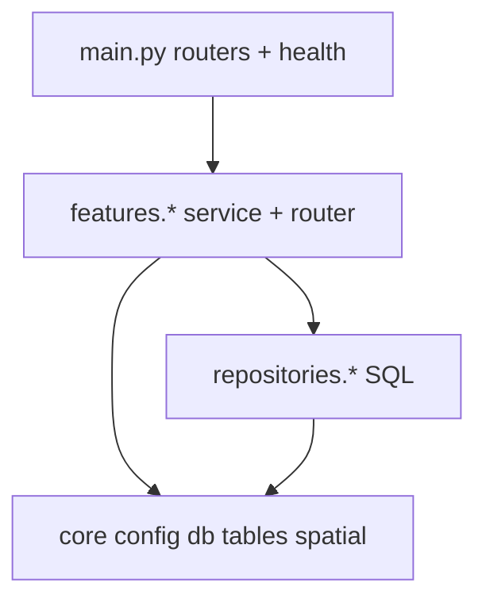

# app/

**What:** The FastAPI application package.  
**Why:** Organized in layers so SQL, business logic, and HTTP stay separated.

---

## Layer diagram

**Dependency rule:** `core` never imports from `features`. Services call repositories for SQL; routers call services only.

Table name constants live in [`core/tables.py`](core/tables.py) — never hardcode schema-qualified names in services.

---

## Entry point

[`main.py`](main.py) wires routers only:

| Router | Prefix | Module |
|--------|--------|--------|
| scores | `/api/v1` | `features.scores` |
| pois | `/api/v1` | `features.pois` |
| properties | `/api/v1` | `features.properties` |
| geo | `/api/v1` | `features.geo` |

Inline endpoints: `/health`, `/ready`, `/metrics` (not in a feature module).

---

## Packages

| Package | Role | README |
|---------|------|--------|
| `core/` | Settings, DB session, metrics, spatial math, table constants | [core/README.md](core/README.md) |
| `repositories/` | All SQL — one repo per table group | [repositories/README.md](repositories/README.md) |
| `features/` | Domain modules (router + service + schemas) | [features/README.md](features/README.md) |

---

## Adding a new feature

1. Create `features/my_feature/` with `router.py`, `service.py`, `schemas.py`.
2. Add repository methods in `repositories/` if new SQL is needed.
3. Register router in `main.py`.
4. Add README in the feature folder.
5. Update [docs/DATA_MODEL.md](../../docs/DATA_MODEL.md) if tables change.

See [docs/ENGINEERING_STANDARDS.md](../../docs/ENGINEERING_STANDARDS.md) for naming and testing conventions.

---

## Further reading

| Doc | Topic |
|-----|-------|
| [features/README.md](features/README.md) | Feature module map |
| [repositories/README.md](repositories/README.md) | Repository pattern |
| [docs/ARCHITECTURE.md](../../docs/ARCHITECTURE.md) | System data flows |
