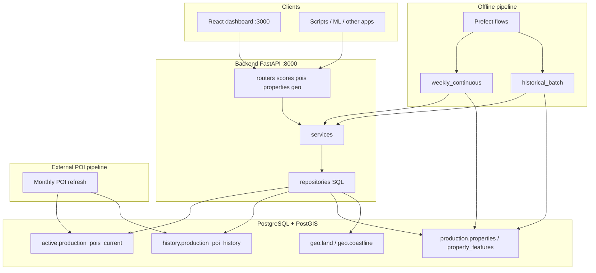
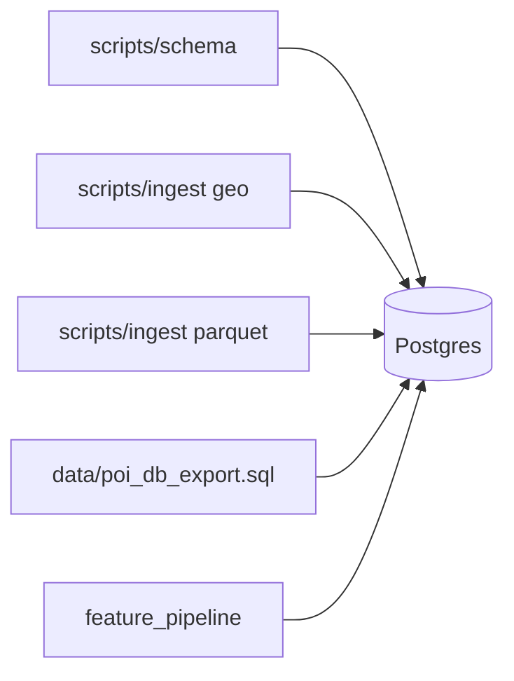

# Architecture — Morocco Spatial Dashboard

**What:** How the dashboard, API, pipeline, and database fit together.  
**Why:** Understand data ownership, scoring modes, and where logic lives before changing code.

---

## System context



**Key points:**

- Dashboard and external clients use the **same REST API**.
- Backend is the **only** component that talks to the database from the app side.
- POI data in `active.*` / `history.*` is **owned by an external pipeline** — this repo reads it.
- `production.*` and `geo.*` tables are **owned by this app** (schema in `scripts/schema/`).

---

## Backend layers

```
main.py          → wires routers + /health, /ready, /metrics
features.*       → business logic (scores, pois, properties, geo, pipeline)
repositories.*   → all SQL queries
core.*           → config, DB session, tables.py, spatial math, metrics
```

See [backend/app/README.md](../backend/app/README.md) and [backend/app/repositories/README.md](../backend/app/repositories/README.md).

**Dependency rule:** `core` never imports from `features`. Table names come from `core/tables.py`.

---

## Two scoring modes

| Mode | Trigger | POI source | Output |
|------|---------|------------|--------|
| **Live API** | HTTP request to `/api/v1/scores` | `active.production_pois_current` (or history via `as_of`) | JSON in response |
| **Batch pipeline** | CLI, Docker, or Prefect | Current snapshot or `history.production_poi_history` at `transaction_date` | Rows in `production.property_features` |

Both use the same functions in `features/scores/service.py`. Details: [scores README](../backend/app/features/scores/README.md).

The **Properties** tab reads **precomputed** features from `production.property_features` — it does not run live scoring per click.

---

## Data flows

### Single-location score (live)

1. User enters coordinates or double-clicks the map.
2. Frontend → `GET /api/v1/scores?lat=…&lon=…` (or POST with JSON body).
3. `scores/service.py`: query POIs within 1 km and 400 m, compute density, diversity, accessibility, nearest, coastal signals.
4. Response: `{ location, scores }`.
5. Frontend → `GET /api/v1/pois?lat=…&lon=…&radius_km=1` for map markers and POI list.

Optional `as_of` date uses `history.production_poi_history` with SCD2 filter (`is_canonical = true`).

### Batch scores (live)

1. User uploads CSV/JSON or pastes coordinates (max 500).
2. Frontend → `POST /api/v1/scores/batch`.
3. Backend runs the same score logic per location; returns ordered results.
4. User exports CSV or clicks a row → Single tab.

### Properties map (precomputed)

1. Frontend → `GET /api/v1/properties` with bounding box and optional admin filters.
2. Backend joins `production.properties` + `production.property_features`.
3. Stats and detail endpoints support admin hierarchy drill-down.

See [properties README](../backend/app/features/properties/README.md).

### Feature pipeline (offline)

1. **Weekly continuous:** detect new POI version via `max(active.audit_pipeline_runs.run_timestamp)`; score pending properties against current POIs.
2. **Historical batch:** for properties with `transaction_date`, score at that date using SCD2 history.
3. Write flattened columns to `production.property_features`; record run in `production.feature_pipeline_runs`.

See [feature_pipeline README](../backend/app/features/feature_pipeline/README.md).

### Local bootstrap (not production)



Production skips dump restore — POI data arrives from the external pipeline.

---

## Frontend

React SPA with three tabs ([frontend/README.md](../frontend/README.md)):

| Tab | Purpose |
|-----|---------|
| Single | Live score + map + POI panel |
| Batch | Live batch scores + export |
| Properties | Precomputed property features on map |

Dev proxy in Vite forwards `/api` to `localhost:8000`.

---

## API endpoints

| Method | Path | Description |
|--------|------|-------------|
| GET | `/health` | Liveness |
| GET | `/ready` | DB connectivity (503 if down) |
| GET | `/metrics` | Prometheus metrics |
| GET/POST | `/api/v1/scores` | Single-location score |
| POST | `/api/v1/scores/batch` | Batch scores (max 500) |
| GET | `/api/v1/pois` | POIs within radius |
| GET | `/api/v1/properties` | Property markers in bbox |
| GET | `/api/v1/properties/stats` | Grouped stats by admin level |
| GET | `/api/v1/properties/{id}` | Property detail + features |
| GET | `/api/v1/geo/land` | Land polygon GeoJSON |
| GET | `/api/v1/geo/coastline` | Coastline GeoJSON |

OpenAPI: http://localhost:8000/docs

---

## Database schemas

| Schema | Owner | Key tables |
|--------|-------|------------|
| `active` | External POI pipeline | `production_pois_current`, `audit_pipeline_runs` |
| `history` | External POI pipeline | `production_poi_history` (SCD2) |
| `production` | This app | `properties`, `property_features`, `feature_pipeline_runs` |
| `geo` | This app (local bootstrap) | `land`, `coastline` |

Full reference: [DATA_MODEL.md](DATA_MODEL.md).

---

## Configuration

| Variable | Used by |
|----------|---------|
| `DATABASE_URL` | API, pipeline, scripts |
| `CORS_ORIGINS` | API |
| `LOG_LEVEL` | API, pipeline |
| `PIPELINE_VERSION` | Pipeline → `property_features` |
| `VITE_API_URL` | Frontend (optional override) |

**Production:** set `DATABASE_URL` to the managed Postgres instance. No code changes.

**Local/dev:** Docker Compose Postgres + optional dump. See [GETTING_STARTED.md](GETTING_STARTED.md).

---

## Further reading

| Doc | Topic |
|-----|-------|
| [DATA_MODEL.md](DATA_MODEL.md) | Tables and columns |
| [RUNBOOK.md](RUNBOOK.md) | Operations |
| [PRODUCTION_POIS_PLATFORM.md](PRODUCTION_POIS_PLATFORM.md) | Production context |
| [PROJECT_SPEC.md](../PROJECT_SPEC.md) | Product requirements |
