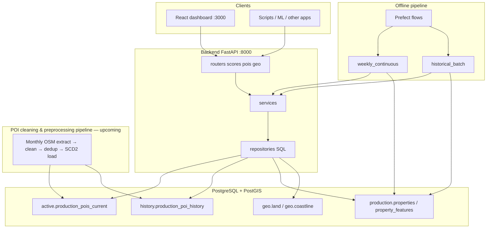

# Architecture — Morocco Spatial Dashboard

How the dashboard, API, pipeline, and database fit together.

---

## System context



- POI data (`active.*`, `history.*`) is produced by the **POI cleaning & preprocessing pipeline** (OSM extract → cleaning → deduplication → taxonomy mapping → SCD2 history). That pipeline is **upcoming** in this repo; today the scoring stack consumes its output tables and a trimmed dump ([POI_EXPORT.md](POI_EXPORT.md)) is used for local development.
- `production.*` and `geo.*` are **owned by the scoring app**.

---

## Backend code layout

```
backend/app/
  main.py           → routers + /health, /ready, /metrics
  core/             → config, DB, tables.py, spatial math
  repositories/     → all SQL (services never embed queries)
  features/
    scores/         → score math (API + pipeline)
    pois/           → POI list queries
    geo/            → GeoJSON overlays
    feature_pipeline/  → batch scoring CLI + Prefect
```

**Rule:** `core` never imports from `features`. Table names in `core/tables.py`.

Pipeline details: [feature_pipeline README](../backend/app/features/feature_pipeline/README.md).

---

## Two scoring modes

| Mode | Trigger | Output |
|------|---------|--------|
| **Live API** | `/api/v1/scores` | JSON per request |
| **Batch pipeline** | CLI / Docker / Prefect | `production.property_features` rows |

Both call `features/scores/service.py`, so the API and the pipeline can never drift apart.

---

## Frontend

React + Vite + Leaflet. Two tabs: **Single** (click the map, see scores + nearby POIs) and **Batch** (upload CSV/JSON, score up to 500 rows, export).

- Dev: Vite proxies `/api` → `localhost:8000`
- Override API: `VITE_API_URL` in `frontend/.env`
- API client: `frontend/src/api.ts`

---

## API endpoints

| Method | Path | Description |
|--------|------|-------------|
| GET | `/health`, `/ready`, `/metrics` | Liveness, readiness, Prometheus |
| GET/POST | `/api/v1/scores` | Single-location score |
| POST | `/api/v1/scores/batch` | Batch (max 500) |
| GET | `/api/v1/pois` | POIs within radius |
| GET | `/api/v1/geo/land`, `/geo/coastline` | GeoJSON overlays |

OpenAPI: http://localhost:8000/docs

---

## Database schemas

| Schema | Owner | Key tables |
|--------|-------|------------|
| `active` | POI cleaning & preprocessing pipeline (upcoming) | `production_pois_current`, `audit_pipeline_runs` |
| `history` | POI cleaning & preprocessing pipeline (upcoming) | `production_poi_history` (SCD2) |
| `production` | Scoring app | `properties`, `property_features`, `feature_pipeline_runs` |
| `geo` | Scoring app | `land`, `coastline` |

Full columns: [DATA_MODEL.md](DATA_MODEL.md). POI dump: [POI_EXPORT.md](POI_EXPORT.md).

---

## Production context

Single Postgres instance (AWS RDS). The POI cleaning & preprocessing pipeline refreshes `active.*` / `history.*` monthly and records each run in `active.audit_pipeline_runs`.

After each POI refresh:

1. Verify new row in `active.audit_pipeline_runs`
2. Run `weekly_continuous` pipeline
3. ML reads `production.property_features` filtered by `poi_refreshed_at`

**Upcoming:** the full POI cleaning & preprocessing pipeline (OSM extract, cleaning, deduplication, taxonomy mapping, SCD2 loading) will be added to this repo. **Remaining gaps:** automated property sync from transactions table, Alembic migrations, ECS deploy automation, auth, Grafana dashboards.

Operations: [GUIDE.md](GUIDE.md).

---

## Observability

| Endpoint | Purpose |
|----------|---------|
| `GET /health` | Liveness — process up |
| `GET /ready` | Readiness — DB reachable (503 if not) |
| `GET /metrics` | Prometheus scrape target |

Set `LOG_LEVEL=info` in production. Configure load balancer probes on `/ready` and `/health`.

---

## Configuration

| Variable | Used by |
|----------|---------|
| `DATABASE_URL` | API, pipeline, scripts |
| `CORS_ORIGINS` | API |
| `LOG_LEVEL` | API, pipeline |
| `PIPELINE_VERSION` | Pipeline |
| `VITE_API_URL` | Frontend build |

Production = set `DATABASE_URL` only. Local setup: [GUIDE.md](GUIDE.md).

---

## Product summary

| Capability | Status |
|------------|--------|
| Live + batch scoring API | Done |
| Properties map (precomputed) | Done |
| Weekly + historical pipeline | Done |
| Prefect orchestration | Done |
| GitLab CI (lint, test 70%, build) | Done |
| Internal auth | Not in v1 |

---

## See also

| Doc | Topic |
|-----|-------|
| [PLATFORM_REFERENCE.md](PLATFORM_REFERENCE.md) | Full detail: pipeline steps, API, DB, Prefect, repo status |
| [GUIDE.md](GUIDE.md) | Setup, ops, deploy |
| [DATA_MODEL.md](DATA_MODEL.md) | Schema reference |
| [CONTRIBUTING.md](../CONTRIBUTING.md) | Standards and CI |
