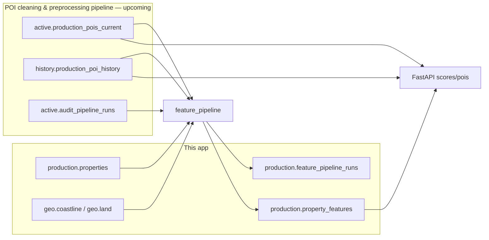

# Data model

**What:** PostgreSQL schemas and tables used by the API and feature pipeline.  
**Why:** The scoring backend only reads the POI tables — they are produced by the POI cleaning & preprocessing pipeline (upcoming in this repo). Use this document to look up correct schema, table, and column names.

**Source of truth in code:** [`backend/app/core/tables.py`](../backend/app/core/tables.py)  
**POI export details:** [POI_EXPORT.md](POI_EXPORT.md) (taxonomy, dump format)  
**Schema SQL:** [`scripts/schema/`](../scripts/schema/)

---

## Schema overview

| Schema | Owner | Purpose |
|--------|-------|---------|
| `active` | POI cleaning & preprocessing pipeline (upcoming) | Current POI snapshot, audit, taxonomy |
| `history` | POI cleaning & preprocessing pipeline (upcoming) | SCD2 versioned POI timeline |
| `production` | Scoring app | Properties, precomputed features, pipeline run ledger |
| `geo` | Scoring app (local bootstrap) | Coastline and land reference polygons |

---

## POI tables (output of the POI cleaning & preprocessing pipeline — read only for the scoring app)

### `active.production_pois_current`

**What the API and pipeline query for live POI data.** Flat snapshot: one row per POI.

| Column | Type | Description |
|--------|------|-------------|
| `osm_id` | text | Primary key — OpenStreetMap element ID |
| `name` | text | POI name (default `'Unnamed'`) |
| `fclass` | text | Fine class (e.g. `bus_stop`, `pharmacy`) |
| `super_category` | text | Category (e.g. Transport, Healthcare) |
| `lat` | double precision | WGS84 latitude |
| `lon` | double precision | WGS84 longitude |
| `geom` | geometry(Point, 4326) | PostGIS point for spatial queries |

**Indexes:** GiST on `geom`; btree on `super_category`.

There is **no** `is_active` column — all rows in this table are the current snapshot.

Use `lat` / `lon` for simple distance logic; use `geom` with PostGIS (`ST_DWithin`, `ST_Distance`) for radius queries.

### `history.production_poi_history`

**What the pipeline uses for temporal scoring** at a property's `transaction_date`. SCD2 versioned timeline (~190k rows in export).

| Column | Type | Description |
|--------|------|-------------|
| `typed_id` | text | OSM element with type prefix (e.g. `n123`, `w456`) |
| `osm_id` | text | OpenStreetMap element ID |
| `osm_type` | text | `node`, `way`, or `relation` |
| `name` | text | POI name |
| `fclass` | text | Fine class |
| `super_category` | text | Category |
| `geom` | geometry(Point, 4326) | PostGIS point for spatial queries |
| `lat` | double precision | Stored latitude (queries prefer `ST_Y(geom)`) |
| `lon` | double precision | Stored longitude (queries prefer `ST_X(geom)`) |
| `version` | integer | SCD2 version number |
| `visible` | boolean | OSM visibility at version time |
| `valid_from` | timestamptz | Version start (inclusive) |
| `valid_to` | timestamptz | Version end (exclusive) |
| `valid_range` | tstzrange | Half-open `[valid_from, valid_to)` — use for temporal filters |
| `matched_tag_key` | text | OSM tag key used for classification |
| `poi_source` | text | Upstream derivation source |
| `tags_json` | jsonb | Raw OSM tags snapshot |
| `dedup_group` | text | Physical POI group (node/way duplicates share a group) |
| `is_canonical` | boolean | `true` = preferred row within a `dedup_group` |

**Query filter (required):** `is_canonical IS TRUE` and `:as_of <@ valid_range`, then **one row per `dedup_group`** (closest geometry). Implemented in `PoiRepository` and `POI_HISTORY_SCD2_WHERE` in `tables.py`.

**Indexes (production dump):** GiST on `geom` (geography cast), `valid_range`; btree on `dedup_group`, `is_canonical`, `osm_type`, `typed_id`.

**Source:** populated by the POI cleaning & preprocessing pipeline (upcoming) or, for local development, restored from [`data/poi_db_export.sql`](../data/poi_db_export.sql). There is no CSV import in this repo.

### `active.audit_pipeline_runs`

**What the weekly pipeline reads** to detect a new POI refresh.

| Column | Type | Description |
|--------|------|-------------|
| `run_timestamp` | timestamptz | When the POI cleaning & preprocessing run finished |
| (other columns) | — | Run metadata written by the POI pipeline |

The feature pipeline uses `max(run_timestamp)` as the current POI version (`poi_refreshed_at`). This app does **not** write to this table.

For taxonomy (`active.categories`, `active.category_mapping`) and full export details, see [POI_EXPORT.md](POI_EXPORT.md).

---

## Geo reference (app-owned — local bootstrap)

Created by [`scripts/schema/feature_pipeline.sql`](../scripts/schema/feature_pipeline.sql). Populate once per fresh database.

### `geo.coastline`

| Column | Type | Description |
|--------|------|-------------|
| `id` | serial | Primary key |
| `name` | text | Optional label |
| `geom` | geometry(MultiLineString, 4326) | Coastline segments |

Load: `python scripts/ingest/load_osm_coastline.py`

### `geo.land`

| Column | Type | Description |
|--------|------|-------------|
| `id` | serial | Primary key |
| `name` | text | Optional label |
| `geom` | geometry(MultiPolygon, 4326) | Land polygon(s) |

Load: `python scripts/ingest/load_osm_land.py`

Without these tables, `dist_coast_km` and `land_buffer_fraction_1km` are NULL.

---

## Feature pipeline tables (app-owned)

Created by [`scripts/schema/apply_feature_pipeline.py`](../scripts/schema/apply_feature_pipeline.py). See [GUIDE.md](GUIDE.md#feature-pipeline).

### `production.properties` (pipeline input)

Slim index of locations to score. Only pipeline-needed columns — rich transaction data lives in the source transactions table (e.g. `analytics.transactions` in prod, `staging.transactions` in dev).

| Column | Type | Description |
|--------|------|-------------|
| `transaction_id` | bigint | Primary key — join key to source transactions |
| `latitude` | double precision | WGS84 latitude |
| `longitude` | double precision | WGS84 longitude |
| `transaction_date` | date | Used by `historical_batch` for temporal POI lookup |

Dev: [`scripts/ingest/load_properties_from_parquet.py`](../scripts/ingest/load_properties_from_parquet.py) loads parquet into `staging.transactions` and syncs slim rows here. Prod: an ETL step copies coords from the 1M-row transactions table. Set `TRANSACTIONS_TABLE` so property attributes can be joined at read time.

### `production.property_features` (output — ML input)

One row per property; flattened spatial indicators. The ML team reads this table directly — no API calls needed.

| Column | Type | Description |
|--------|------|-------------|
| `transaction_id` | bigint | PK, FK → `properties(transaction_id)` — join directly to source transactions |
| `poi_refreshed_at` | timestamptz | POI version used — **use for reproducibility** |
| `pipeline_version` | text | Pipeline code version |
| `computed_at` | timestamptz | When the row was written |
| `poi_count_1km` | integer | POIs within 1 km |
| `poi_count_400m` | integer | POIs within 400 m |
| `n_categories` | integer | Distinct super_categories within 1 km |
| `n_poi_types` | integer | Distinct fclass values within 1 km |
| `entropy` | double precision | Shannon entropy of super_category (bits) |
| `entropy_fclass` | double precision | Shannon entropy of fclass (bits) |
| `aggregate_score` | double precision | Aggregate score 0–100 (nullable) |
| `acc_*` (13 booleans) | boolean | Accessibility within 400 m |
| `by_category` | jsonb | POI count per super_category (1 km) |
| `nearest_km` | jsonb | Distance to nearest POI per super_category |
| `dist_coast_km` | double precision | Distance to coastline (NULL if geo not loaded) |
| `land_buffer_fraction_1km` | double precision | Fraction of 1 km buffer on land |
| `transaction_date` | date | Date used for temporal POI lookup (nullable) |
| `poi_source` | text | `'history'` or `'current'` |

Index: `property_features(poi_refreshed_at)` for pending-property queries.

### `production.feature_pipeline_runs` and `production.feature_pipeline_failures`

Run ledger for pipeline executions. Defined in [`scripts/schema/feature_pipeline_runs.sql`](../scripts/schema/feature_pipeline_runs.sql).

Key columns on `feature_pipeline_runs`: `run_id`, `flow_name`, `status`, `started_at`, `finished_at`, `processed`, `failed`, `poi_refreshed_at`, `triggered_by`.

See [`backend/app/features/feature_pipeline/README.md`](../backend/app/features/feature_pipeline/README.md) for query examples.

---

## CI minimal schema

For tests without a full dump, CI applies [`scripts/schema/init_schema_ci.sql`](../scripts/schema/init_schema_ci.sql), which creates empty `active.production_pois_current` and `history.production_poi_history` with the contract columns above.

---

## Schema change policy

- **POI schema (`active.*`, `history.*`):** owned by the POI cleaning & preprocessing pipeline (upcoming). Until it lands, treat these tables as a fixed contract; the scoring app never alters them.
- **App schema (`production.*`, `geo.*`):** apply via `scripts/schema/` SQL and update this doc in the same MR.
- **When renaming tables:** update `backend/app/core/tables.py` first, then this file, [GUIDE.md](GUIDE.md), and [scripts/README.md](../scripts/README.md).
