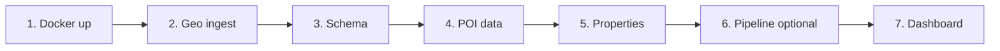

# Getting started

**What:** Step-by-step guide to run the Morocco Spatial Dashboard locally.  
**Why:** Get from zero to a working API and dashboard with sample data.

**Prerequisites:** [Docker](https://docs.docker.com/get-docker/), [Git](https://git-scm.com/), Python 3.12+ (for scripts outside Docker). See [backend/REQUIREMENTS.md](../backend/REQUIREMENTS.md) for venv setup.

---

## Overview



---

## Step 1 — Environment and Docker

```bash
cp .env.example .env
docker compose up -d
docker compose ps
```

| Service | URL |
|---------|-----|
| Backend API + OpenAPI | http://localhost:8000/docs |
| pgAdmin | http://localhost:5050 (`admin@admin.com` / `admin`) |

Health check: `curl http://localhost:8000/health`

To start only Postgres first (e.g. before a dump restore):

```bash
docker compose up -d db
```

---

## Step 2 — Geo reference (required once)

Coastline and land polygons are needed for coastal scoring fields.

```bash
cd backend
python -m venv .venv
# Windows: .\.venv\Scripts\Activate.ps1
pip install -r requirements-ingest.txt
cd ..
python scripts/ingest/load_osm_coastline.py
python scripts/ingest/load_osm_land.py
```

Without this step, `dist_coast_km` and `land_buffer_fraction_1km` stay NULL.

---

## Step 3 — Apply app schema

Creates `production.*` and `geo.*` tables:

```bash
python scripts/schema/apply_feature_pipeline.py
```

For CI-style empty POI tables (tests only):

```bash
python scripts/schema/apply_init.py
```

---

## Step 4 — POI data (local)

**Option A — full dump (recommended for realistic scores):**

Restore [`data/poi_db_export.sql`](../data/poi_db_export.sql) — see [data/README.md](../data/README.md) and [RUNBOOK](RUNBOOK.md#restore-the-poi-dump-local--dev-only).

**Option B — minimal CI schema:**

```bash
python scripts/schema/apply_init.py
```

POI tables will be empty; scores return zero counts until you load data.

**Production:** skip this step — POI data comes from the external pipeline.

---

## Step 5 — Load properties (optional)

For the Properties tab and batch pipeline:

```bash
python scripts/ingest/load_properties_from_parquet.py \
  --parquet input/casablanca_transactions_sample.parquet
```

Adjust the path to your Parquet file.

---

## Step 6 — Run the feature pipeline (optional)

Precomputes scores into `production.property_features` for ML and the Properties map.

```bash
docker compose --profile pipeline run --rm pipeline
```

Or from `backend/` with pipeline venv:

```bash
pip install -r requirements-pipeline.txt
python -m app.features.feature_pipeline weekly_continuous
```

See [feature_pipeline README](../backend/app/features/feature_pipeline/README.md).

---

## Step 7 — Run the dashboard

1. API should already be running via Docker (`docker compose up -d`).
2. Start the frontend:

```bash
cd frontend
npm install
npm run dev
```

Open http://localhost:3000

| Tab | What it does |
|-----|--------------|
| Single | Score one location on the map |
| Batch | Score many locations from CSV/JSON |
| Properties | Browse precomputed property features on a map |

Set `VITE_API_URL` in `frontend/.env` if the API is not on `http://localhost:8000`.

---

## Run the API without Docker

With Postgres running and data loaded:

```bash
cd backend
pip install -r requirements-dev.txt
uvicorn app.main:app --reload --host 0.0.0.0 --port 8000
```

Set `DATABASE_URL` in `.env` at project root.

---

## Run tests

```bash
cd backend
pip install -r requirements-dev.txt
pytest tests/unit -v          # no DB required
pytest tests/integration -v   # needs Postgres + schema
```

CI runs `apply_init.py` then pytest with 70% coverage floor. See [CONTRIBUTING.md](../CONTRIBUTING.md).

---

## Next steps

| Topic | Doc |
|-------|-----|
| All CLI commands | [scripts/README.md](../scripts/README.md) |
| Table and column reference | [DATA_MODEL.md](DATA_MODEL.md) |
| System architecture | [ARCHITECTURE.md](ARCHITECTURE.md) |
| Full documentation index | [docs/README.md](README.md) |
