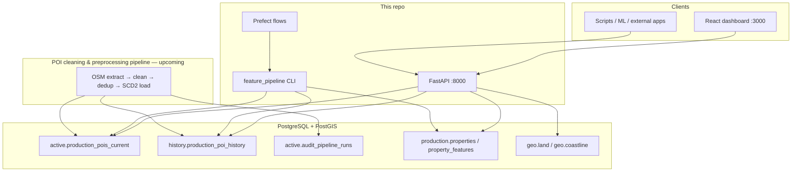
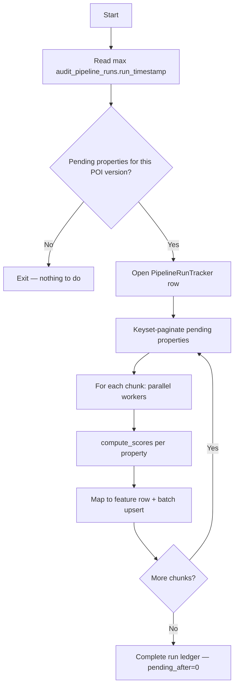

# Platform reference

Detailed technical reference for the Morocco Spatial Dashboard: architecture, database, pipeline, API, and current repo state.

For setup commands see [GUIDE.md](GUIDE.md). For table columns see [DATA_MODEL.md](DATA_MODEL.md).

---

## 1. Current repo status

### What this project is

POI-based spatial scoring for Morocco. It provides:

- A **FastAPI** REST API for live single and batch scoring
- A **React** dashboard (Single and Batch tabs)
- An **offline feature pipeline** that precomputes scores into `production.property_features` for ML
- **Prefect** flow wrappers for scheduled pipeline runs

### Branch and working tree (as of last update)

| Item | Status |
|------|--------|
| Active branch | `cleanup/main` |
| Documentation | Consolidated to 4 central docs + this reference |
| Backend layout | Feature-based (`app/features/`) + repository layer |
| CI | GitHub Actions: lint → test on PostGIS (50% coverage ratchet) → docker build |
| Production deploy | Manual from tagged release — not automated in CI |

### Repository layout

```
pois_scores_v2/
├── backend/                 FastAPI app, pipeline, tests
│   └── app/
│       ├── main.py          API entry + /health, /ready, /metrics
│       ├── core/            config, db, tables.py, spatial, constants
│       ├── repositories/    all SQL queries
│       └── features/
│           ├── scores/      score math (API + pipeline)
│           ├── pois/        POI list queries
│           ├── geo/         GeoJSON overlays
│           └── feature_pipeline/  batch CLI + Prefect flows
├── frontend/                React + Vite + Leaflet dashboard
├── scripts/
│   ├── schema/              SQL apply scripts (CI + local)
│   └── ingest/              geo loaders, parquet ingest
├── docs/                    GUIDE, ARCHITECTURE, DATA_MODEL, POI_EXPORT, this file
├── data/                    POI SQL dumps (gitignored)
├── input/                   Sample parquet files
└── samples/                 Batch test CSV/JSON
```

### Docker Compose services

| Service | Port | Profile | Purpose |
|---------|------|---------|---------|
| `db` | 5432 | default | PostGIS 16 |
| `backend` | 8000 | default | FastAPI API |
| `pgadmin` | 5050 | default | DB admin UI |
| `pipeline` | — | `pipeline` | Runs `weekly_continuous` on demand |

### What is implemented vs planned

| Area | Status |
|------|--------|
| Live + batch scoring API | Done |
| Temporal scoring (`as_of` date) | Done |
| Weekly + historical pipeline | Done |
| Prefect orchestration | Done |
| Geo coastline/land loaders | Done |
| Parquet property ingest | Done |
| GitHub Actions CI (lint, test on PostGIS, docker build) | Done |
| POI cleaning & preprocessing pipeline (OSM extract → clean → dedup → taxonomy → SCD2 load) | **Upcoming** |
| Automated property sync from prod transactions table | Planned |
| Alembic migrations | Planned |
| User authentication | Not in v1 |
| Automated AWS/ECS deploy | Planned |
| Grafana dashboards | Planned |

### CI pipeline (`.github/workflows/ci.yml`)

Runs on every push to `main` and every pull request.

| Job | What it does |
|-----|--------------|
| `backend-lint` | Ruff check + format on `backend/` |
| `backend-test` | PostGIS 16 service container → `apply_init.py` + `apply_feature_pipeline.py` → pytest (unit + integration), 50% coverage ratchet |
| `backend-build` | Docker build of the API image (buildx, GHA layer cache); needs lint + test green |
| `frontend` | `npm ci` → ESLint → Prettier check → Vitest → Vite production build |

---

## 2. Architecture

### System diagram



### Backend layers

```
main.py
  └── features/*/router.py     HTTP layer (validation, response models)
        └── features/*/service.py   business logic
              └── repositories/*.py   SQL only
                    └── core/tables.py   canonical table names
```

**Rules:**

- `core` never imports from `features`
- Services never embed raw SQL or table name strings
- All table names live in `backend/app/core/tables.py`

### Two scoring modes

| Mode | Entry point | POI source | Output |
|------|-------------|------------|--------|
| **Live API** | `GET/POST /api/v1/scores` | `active.production_pois_current` (or history via `as_of`) | JSON response |
| **Batch pipeline** | CLI / Docker / Prefect | Current snapshot or SCD2 history at `transaction_date` | `production.property_features` rows |

Both call the same functions in `app/features/scores/service.py`:

- `compute_scores()` — current POI snapshot
- `compute_scores_at_date()` — historical POI at a given date

Precomputed rows in `production.property_features` are the ML-ready output of the pipeline; downstream models read them directly from the database.

### Frontend

| Tab | API used | Data source |
|-----|----------|-------------|
| Single | `/scores`, `/pois` | Live computation |
| Batch | `/scores/batch` | Live computation |

Dev server proxies `/api` → `http://localhost:8000`. Override with `VITE_API_URL`.

### Observability

| Endpoint | Type | Behaviour |
|----------|------|-----------|
| `GET /health` | Liveness | Always 200 if process is up |
| `GET /ready` | Readiness | 200 if DB reachable, 503 otherwise |
| `GET /metrics` | Prometheus | Scrape target for monitoring |

Log level controlled by `LOG_LEVEL` env var.

---

## 3. Database

### Schema ownership

| Schema | Owner | This app |
|--------|-------|----------|
| `active` | POI cleaning & preprocessing pipeline (upcoming) | Read |
| `history` | POI cleaning & preprocessing pipeline (upcoming) | Read (SCD2) |
| `staging` | Dev ingest / prod sync | Read/write (ingest) |
| `production` | Scoring app | Read/write |
| `geo` | Scoring app (bootstrap scripts) | Read/write |

### Key tables

| Table | Purpose |
|-------|---------|
| `active.production_pois_current` | Flat current POI snapshot (~72k rows in export) |
| `history.production_poi_history` | SCD2 versioned POI timeline (~190k rows) |
| `active.audit_pipeline_runs` | POI cleaning & preprocessing run timestamps |
| `active.categories` / `category_mapping` | Taxonomy (11 categories, 91 fclasses) |
| `production.properties` | Property locations to score |
| `production.property_features` | Precomputed spatial features (ML input) |
| `production.feature_pipeline_runs` | Pipeline run ledger |
| `production.feature_pipeline_failures` | Per-property failures when `--skip-errors` |
| `geo.coastline` | OSM coastline for `dist_coast_km` |
| `geo.land` | Land polygon for `land_buffer_fraction_1km` |
| `staging.transactions` | Dev default for parquet ingest source |

Canonical names: `backend/app/core/tables.py`.  
Full column lists: [DATA_MODEL.md](DATA_MODEL.md).  
POI dump format: [POI_EXPORT.md](POI_EXPORT.md).

### SCD2 history filter

When querying `history.production_poi_history`:

```sql
is_canonical IS TRUE
AND CAST(:as_of AS timestamptz) <@ valid_range
```

Then deduplicate with `DISTINCT ON (dedup_group) … ORDER BY dedup_group, distance` so node/way doubles for the same physical POI count once. Encoded in `PoiRepository` (`backend/app/repositories/poi.py`) and `POI_HISTORY_SCD2_WHERE` in `tables.py`.

### POI version detection (weekly pipeline)

The weekly flow uses:

```sql
SELECT max(run_timestamp) FROM active.audit_pipeline_runs
```

as `poi_refreshed_at` — the timestamp written to each `property_features` row.

---

## 4. Feature pipeline (step by step)

### Overview — two flows

| Flow | CLI command | POI source | `poi_source` column | When to use |
|------|-------------|------------|---------------------|-------------|
| `weekly_continuous` | `python -m app.features.feature_pipeline weekly_continuous` | `active.production_pois_current` | `'current'` | After each POI cleaning & preprocessing run |
| `historical_batch` | `python -m app.features.feature_pipeline historical_batch` | `history.production_poi_history` | `'history'` | One-time backfill at `transaction_date` |

### CLI flags

| Flag | Default | Description |
|------|---------|-------------|
| `--chunk-size N` | 200 (weekly) / 1000 (historical) | Properties per chunk before upsert |
| `--workers N` | `PIPELINE_WORKERS` env (4) | Parallel worker threads |
| `--skip-errors` | off | Skip failing properties instead of aborting |

### Docker

```bash
docker compose --profile pipeline run --rm pipeline
# default command: weekly_continuous

docker compose --profile pipeline run --rm pipeline \
  python -m app.features.feature_pipeline historical_batch --skip-errors
```

### Weekly continuous — step by step



**Detailed steps:**

1. **Detect POI version** — `get_current_poi_ts()` reads `max(active.audit_pipeline_runs.run_timestamp)`.
2. **Count pending** — properties in `production.properties` without a `property_features` row for that `poi_refreshed_at`.
3. **Exit early** if `pending = 0` (idempotent).
4. **Open run ledger** — insert row in `production.feature_pipeline_runs` (status `running`).
5. **Keyset pagination** — fetch chunks with `WHERE id > :last_id ORDER BY id LIMIT :chunk_size` (no OFFSET).
6. **Parallel scoring** — `ThreadPoolExecutor` with `PIPELINE_WORKERS` threads; each thread gets its own DB session.
7. **Per property** — call `compute_scores(session, lat, lon)` (same logic as live API).
8. **Map result** — `score_dict_to_feature_row()` flattens scores into table columns + JSONB fields.
9. **Batch upsert** — `INSERT … ON CONFLICT (property_id) DO UPDATE` per chunk.
10. **Progress log** — ETA, props/sec, percentage after each chunk.
11. **Complete run** — update ledger with `processed`, `pending_after`, `duration_seconds`.

**Resumability:** re-running the same command skips properties that already have a valid row for the current POI version.

### Historical batch — step by step

Same chunking/parallelism as weekly, but:

1. **Pending** = properties with `transaction_date` that lack a `property_features` row scored at that date with `poi_source = 'history'`.
2. **Per property** — `compute_scores_at_date(session, lat, lon, transaction_date)` queries SCD2 history.
3. **`poi_refreshed_at`** = midnight UTC of `transaction_date`.
4. **`transaction_date`** and **`poi_source = 'history'`** are stored on the output row.

Designed for bulk backfill of ~150k–800k historical transactions.

### Internal algorithm (per property)

1. Combined CTE query — POIs within 25 km, split into 1 km / 400 m buckets in Python.
2. Coastal query — distance to coastline + land fraction in 1 km buffer.
3. Compute density, diversity (entropy), accessibility flags, nearest-by-category, aggregate score.
4. Flatten to `property_features` columns.

**Query budget:** ~2 SQL round-trips per property (not 5).

### Run ledger tables

After each run, query:

```sql
SELECT flow_name, status, started_at, finished_at,
       processed, skipped, failed, pending_before, pending_after,
       poi_refreshed_at, pipeline_version
FROM production.feature_pipeline_runs
ORDER BY started_at DESC
LIMIT 10;
```

Failures (with `--skip-errors`) go to `production.feature_pipeline_failures`.

### Tuning for large runs

```dotenv
PIPELINE_WORKERS=4        # match CPU cores
DB_POOL_SIZE=8            # >= PIPELINE_WORKERS
DB_MAX_OVERFLOW=10
PIPELINE_VERSION=1.0
```

Example for ~150k properties:

```bash
python -m app.features.feature_pipeline historical_batch \
  --chunk-size 500 --workers 8 --skip-errors
```

---

## 5. Prefect

### Flow definitions

File: `backend/app/features/feature_pipeline/flow.py`

| Prefect flow | Wraps | Schedule |
|--------------|-------|----------|
| `weekly_recompute_flow` | `run_weekly_continuous()` | Intended weekly (after POI refresh) |
| `historical_backfill_flow` | `run_historical_batch()` | Manual one-shot |

### Weekly Prefect flow — decision logic

1. `get_latest_external_refresh()` — read `max(active.audit_pipeline_runs.run_timestamp)`.
2. If no timestamp → **skip** (`no_external_refresh`).
3. `get_latest_processed_refresh()` — read `max(poi_refreshed_at)` from `property_features`.
4. `count_pending_for_refresh(external_ts)`.
5. If already processed and `pending = 0` → **skip** (`already_up_to_date`).
6. Otherwise run `run_weekly_continuous()` inside `PipelineRunTracker`.
7. If `pending_after != 0` after run → raise `RuntimeError` (incomplete run).

### Local Prefect run

```bash
cd backend
pip install -r requirements-pipeline.txt
export DATABASE_URL="postgresql://..."
python -c "from app.features.feature_pipeline.flow import weekly_recompute_flow; weekly_recompute_flow()"
```

### Prefect Cloud (optional)

1. `prefect cloud login`
2. `prefect variable set database_url "postgresql://..."`
3. Deploy flows from GitLab repo with managed work pool
4. Schedule `weekly_recompute_flow` after expected POI refresh (e.g. day 1 at 02:00)

**Contract:** the POI cleaning & preprocessing pipeline must write a new row to `active.audit_pipeline_runs` on each refresh. If it does not, the weekly flow skips.

---

## 6. API reference

Base URL: `http://localhost:8000` (dev). Prefix: `/api/v1`.  
Interactive docs: http://localhost:8000/docs

### Health and metrics (no `/api/v1` prefix)

| Method | Path | Response | Notes |
|--------|------|----------|-------|
| GET | `/health` | `{"status": "ok"}` | Liveness |
| GET | `/ready` | `{"status": "ok"}` or 503 | DB connectivity check |
| GET | `/metrics` | Prometheus text | Not in OpenAPI schema |

---

### Scores — `/api/v1/scores`

#### GET `/api/v1/scores`

Single-location score via query params.

| Param | Type | Required | Description |
|-------|------|----------|-------------|
| `lat` | float | yes | -90 to 90 |
| `lon` | float | yes | -180 to 180 |
| `as_of` | date | no | Historical POI snapshot at this date (YYYY-MM-DD) |

**Response:**

```json
{
  "location": { "lat": 33.5, "lon": -7.6 },
  "scores": {
    "poi_count_1km": 42,
    "poi_count_400m": 8,
    "n_categories": 6,
    "n_poi_types": 12,
    "entropy": 2.1,
    "entropy_fclass": 2.8,
    "entropy_norm": 0.82,
    "entropy_fclass_norm": 0.75,
    "by_category": { "Transport": 5, "Healthcare": 3 },
    "accessibility_400m": { "bus_stop": true, "pharmacy": false },
    "nearest_km": { "Transport": 0.12, "Healthcare": 0.45 },
    "aggregate_score": 67.5,
    "dist_coast_km": 2.3,
    "land_buffer_fraction_1km": 1.0,
    "poi_source": "current"
  }
}
```

#### POST `/api/v1/scores`

Same response as GET. Body:

```json
{ "lat": 33.5, "lon": -7.6, "as_of": "2019-06-15" }
```

#### POST `/api/v1/scores/batch`

Score up to **500** locations in one request.

**Request:**

```json
{
  "locations": [
    { "lat": 33.5, "lon": -7.6 },
    { "lat": 34.0, "lon": -6.8, "as_of": "2020-01-01", "id": "site-1" }
  ]
}
```

- `id` is optional client-side correlation only — **not echoed** in response; match by index.
- Results returned in the **same order** as input.

**Response:**

```json
{
  "results": [
    { "location": { "lat": 33.5, "lon": -7.6 }, "scores": { ... } },
    { "location": { "lat": 34.0, "lon": -6.8 }, "scores": { ... } }
  ]
}
```

---

### POIs — `/api/v1/pois`

#### GET `/api/v1/pois`

POIs within radius for map display and right panel.

| Param | Type | Default | Description |
|-------|------|---------|-------------|
| `lat` | float | required | Center latitude |
| `lon` | float | required | Center longitude |
| `radius_km` | float | 1.0 | 0.1 to max (see constants) |
| `as_of` | date | none | Historical POIs at this date |

**Response:**

```json
{
  "pois": [
    {
      "osm_id": "123456789",
      "name": "Pharmacie Centrale",
      "fclass": "pharmacy",
      "super_category": "Healthcare",
      "lat": 33.501,
      "lon": -7.601,
      "distance_km": 0.08
    }
  ]
}
```

---

### Geo — `/api/v1/geo`

#### GET `/api/v1/geo/land`

Morocco land polygon as GeoJSON (map overlay).

#### GET `/api/v1/geo/coastline`

OSM coastline segments as GeoJSON (map overlay).

---

## 7. Environment variables

| Variable | Default | Used by | Description |
|----------|---------|---------|-------------|
| `DATABASE_URL` | — | All | PostgreSQL connection string |
| `LOG_LEVEL` | `info` | API, pipeline | Python log level |
| `CORS_ORIGINS` | `localhost:3000` | API | Comma-separated allowed origins |
| `PIPELINE_VERSION` | `1.0` | Pipeline | Written to `property_features` |
| `PIPELINE_WORKERS` | `4` | Pipeline | Parallel scoring threads |
| `DB_POOL_SIZE` | `5` | API, pipeline | SQLAlchemy pool size |
| `DB_MAX_OVERFLOW` | `10` | API, pipeline | Extra connections beyond pool |
| `VITE_API_URL` | — | Frontend build | Public API base URL |
| `TRANSACTIONS_TABLE` | `staging.transactions` | Ingest | Source table for property sync |

---

## 8. Related docs

| Doc | Contents |
|-----|----------|
| [GUIDE.md](GUIDE.md) | Setup, operations, deployment |
| [ARCHITECTURE.md](ARCHITECTURE.md) | Shorter system overview |
| [DATA_MODEL.md](DATA_MODEL.md) | Full table/column reference |
| [POI_EXPORT.md](POI_EXPORT.md) | POI dump and taxonomy |
| [scripts/README.md](../scripts/README.md) | CLI command cheat sheet |
| [feature_pipeline README](../backend/app/features/feature_pipeline/README.md) | Pipeline module internals |
