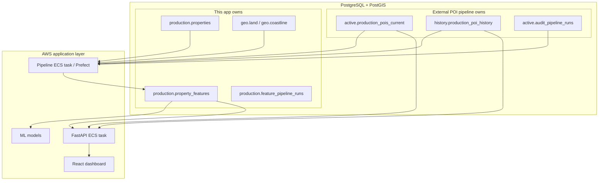

# Production POIs Platform

**What:** How this app fits into the production environment — data ownership, refresh cadence, and deployment context.  
**Why:** Clarify what we build vs what the external POI pipeline provides.

---

## 0. Context and constraints

| Question | Answer |
|----------|--------|
| Database engine | PostgreSQL + PostGIS (single instance) |
| Topology | One Postgres — POIs, properties, and features in different schemas |
| Transaction volume | ~800,000 properties (target scale) |
| POI refresh cadence | Monthly (external pipeline); weekly pipeline option under evaluation |
| OSM data ownership | Colleague-managed extraction → `active.*` / `history.*` schemas |
| Feature output | `production.property_features` — ML input + dashboard |
| Consumers | ML models + internal React dashboard |
| Auth | Internal only — no public API in v1 |
| Deployment target | AWS (ECS/EC2 + RDS or similar) |

---

## 1. What the platform does today

This codebase is a **working production-ready prototype**:

| Capability | Implementation |
|------------|----------------|
| Live POI scoring | FastAPI `/api/v1/scores` against `active.production_pois_current` |
| Temporal scoring | `as_of` param + `history.production_poi_history` (SCD2) |
| Batch API | `/api/v1/scores/batch` (max 500 locations) |
| Property map | `/api/v1/properties/*` reading precomputed features |
| Offline pipeline | `weekly_continuous` + `historical_batch` → `production.property_features` |
| Prefect flows | `weekly_recompute_flow`, `historical_backfill_flow` |
| Geo reference | `scripts/ingest/load_osm_*.py` → `geo.land`, `geo.coastline` |
| Dashboard | React — Single, Batch, Properties tabs |
| CI | GitLab: lint, test (70% coverage), Docker build, frontend pipeline |
| Observability | `/health`, `/ready`, `/metrics` (Prometheus) |

Architecture detail: [ARCHITECTURE.md](ARCHITECTURE.md).

---

## 2. Production architecture

Everything lives in **one PostgreSQL instance** on AWS RDS (or equivalent):



**Key simplifications:**

- No separate POI database — cross-schema SQL joins only.
- No Overpass pipeline in this repo — colleague provides POI tables.
- ML reads `property_features` directly — no API hop.

---

## 3. Data ownership

| Schema / table | Owner | This app |
|----------------|-------|----------|
| `active.production_pois_current` | External POI pipeline | Read |
| `history.production_poi_history` | External POI pipeline | Read (SCD2 queries) |
| `active.audit_pipeline_runs` | External POI pipeline | Read (POI version detection) |
| `active.categories`, `category_mapping` | External POI pipeline | Read (taxonomy) |
| `production.properties` | This app (+ sync from transactions) | Read/write |
| `production.property_features` | This app | Write (pipeline), read (API/ML) |
| `production.feature_pipeline_runs` | This app | Write |
| `geo.land`, `geo.coastline` | This app | Read/write (bootstrap scripts) |

POI taxonomy: **11 super-categories**, **91 fclass mappings** — see [data/README.md](../data/README.md).

---

## 4. The pipeline in production

### 4.1 POI refresh (external)

The colleague's pipeline:

1. Downloads OSM data for Morocco.
2. Loads raw staging tables (not shipped in our export).
3. Produces `active.production_pois_current` and `history.production_poi_history`.
4. Records completion in `active.audit_pipeline_runs`.

**Our contract:** query `active.production_pois_current` with `lat`/`lon`/`geom`; filter history with `is_canonical = true` and `valid_from <= as_of < valid_to`.

### 4.2 Property sync

| Environment | Source | Method |
|-------------|--------|--------|
| Local/dev | Parquet file | `scripts/ingest/load_properties_from_parquet.py` → `staging.transactions` + slim `production.properties` |
| Production | Transactions table in same Postgres (e.g. `analytics.transactions`) | External ETL copies coords into slim `production.properties`; set `TRANSACTIONS_TABLE` for dashboard joins |

### 4.3 Feature computation (this app)

| Flow | When | POI source |
|------|------|------------|
| `weekly_continuous` | After external POI refresh | `active.production_pois_current` |
| `historical_batch` | One-time or on-demand backfill | `history.production_poi_history` at `transaction_date` |

Trigger options:

- **Docker:** `docker compose --profile pipeline run --rm pipeline`
- **Prefect:** scheduled `weekly_recompute_flow` (e.g. day 1 at 02:00)
- **Manual CLI:** `python -m app.features.feature_pipeline weekly_continuous`

Pending detection: properties missing a `property_features` row for the latest `max(active.audit_pipeline_runs.run_timestamp)`.

Details: [feature_pipeline README](../backend/app/features/feature_pipeline/README.md).

### 4.4 Geo reference

Coastline and land polygons are **not** from the POI pipeline. Load once per environment:

```bash
python scripts/ingest/load_osm_coastline.py
python scripts/ingest/load_osm_land.py
```

Required for `dist_coast_km` and `land_buffer_fraction_1km`.

---

## 5. Application layer

### FastAPI backend

| Endpoint group | Data source | Compute |
|----------------|-------------|---------|
| `/scores` | POI tables + geo | Live per request |
| `/pois` | POI tables | Live query |
| `/properties` | `property_features` | Precomputed read |
| `/geo/*` | `geo.*` | Static reference |

### React dashboard

Internal employees use three tabs — see [frontend/README.md](../frontend/README.md).

### ML consumption

```sql
SELECT * FROM production.property_features
WHERE poi_refreshed_at = (
  SELECT max(run_timestamp) FROM active.audit_pipeline_runs
);
```

Use `poi_refreshed_at` and `pipeline_version` for reproducible training runs.

---

## 6. What's implemented vs remaining gaps

### Implemented

- Repository layer and feature-based backend layout
- Weekly + historical pipeline flows with run ledger
- Prefect flow wrappers
- Geo ingest scripts in repo
- GitLab CI with coverage gate
- Properties dashboard tab
- Correct POI schema contract (`active`/`history`)

### Remaining gaps (future work)

| Area | Current state | Target |
|------|---------------|--------|
| **Property sync** | Parquet loader for dev | Automated sync from transactions table in prod |
| **Schema migrations** | SQL scripts in `scripts/schema/` | Alembic for app-owned DDL |
| **Pipeline scale** | Chunked processing (~200 rows/chunk) | Tune chunk size / parallel workers for 800k rows |
| **Deploy automation** | CI builds image only | ECS/RDS deploy pipeline |
| **Monitoring** | `/metrics` endpoint | Grafana dashboards + alerts |
| **Auth** | None | Internal SSO or API keys |
| **Doc drift CI** | Manual | Grep check for stale schema names |

---

## 7. Operational checklist

After each external POI refresh:

1. Verify new row in `active.audit_pipeline_runs`.
2. Run `weekly_continuous` (Prefect or Docker).
3. Confirm `pending_after = 0` in latest `production.feature_pipeline_runs` row.
4. Spot-check scores via dashboard Single tab.
5. Notify ML team of new `poi_refreshed_at` for retraining decision.

Full commands: [RUNBOOK.md](RUNBOOK.md).

---

## 8. Agreement points with POI pipeline owner

| Topic | Current contract |
|-------|------------------|
| Current POI table | `active.production_pois_current` |
| History table | `history.production_poi_history` (SCD2) |
| Column names | `osm_id`, `name`, `fclass`, `super_category`, `lat`, `lon`, `geom` |
| History filter | `is_canonical = true`, `valid_from` / `valid_to` |
| Refresh signal | `active.audit_pipeline_runs.run_timestamp` |
| Spatial indexes | GiST on `geom` (maintained by POI pipeline) |
| Taxonomy | 11 categories, 91 fclass mappings in `active.category_mapping` |

---

## Further reading

| Doc | Topic |
|-----|-------|
| [DATA_MODEL.md](DATA_MODEL.md) | Full schema reference |
| [ARCHITECTURE.md](ARCHITECTURE.md) | System diagrams |
| [PROJECT_SPEC.md](../PROJECT_SPEC.md) | Product requirements |
| [RELEASE_AND_DEPLOY.md](RELEASE_AND_DEPLOY.md) | Release process |
